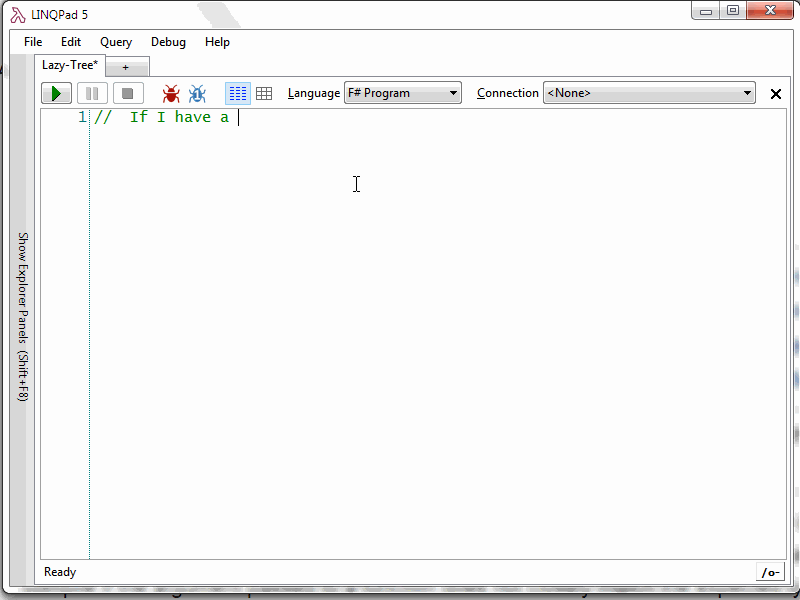

- title : Exploring POCOs with Reflection!
- description : Introduction to React Native with F#
- author : Steve Goguen
- theme : night
- transition : default

***

## Exploring POCOs with Reflection

 
 

### Automatically Generating Interfaces with F#

 
 
Steve Goguen - [@sgoguen](http://www.twitter.com/sgoguen)

***

### Tonight's Agenda

* A Demo
* Creating an Extensible Object Displayer
* Navigating Object Graphs
* Using Reflection to Create Functions

***

### Creating a Lazy Tree

# Demo

---

 
 
---

###  What do we need to navigate an object?

### A Lazy Expandable Tree

    type Tree<'a>(value:'a, getChildren: 'a -> seq<'a>) = 
        member this.Value = value
        member this.Children = 
            seq { for item in getChildren(value) do
                    yield Tree(item, getChildren) }

*** 

### Thank you!

* https://github.com/fable-compiler/fable-elmish
* https://ionide.io
* https://facebook.github.io/react-native/

